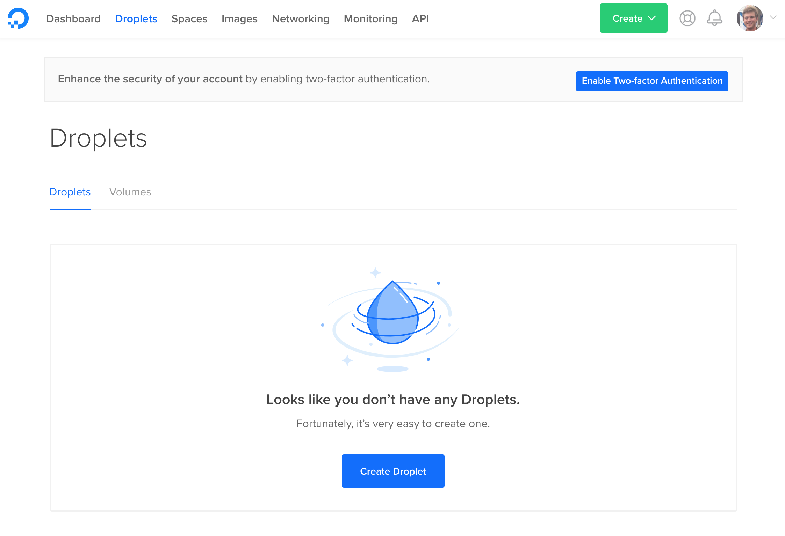
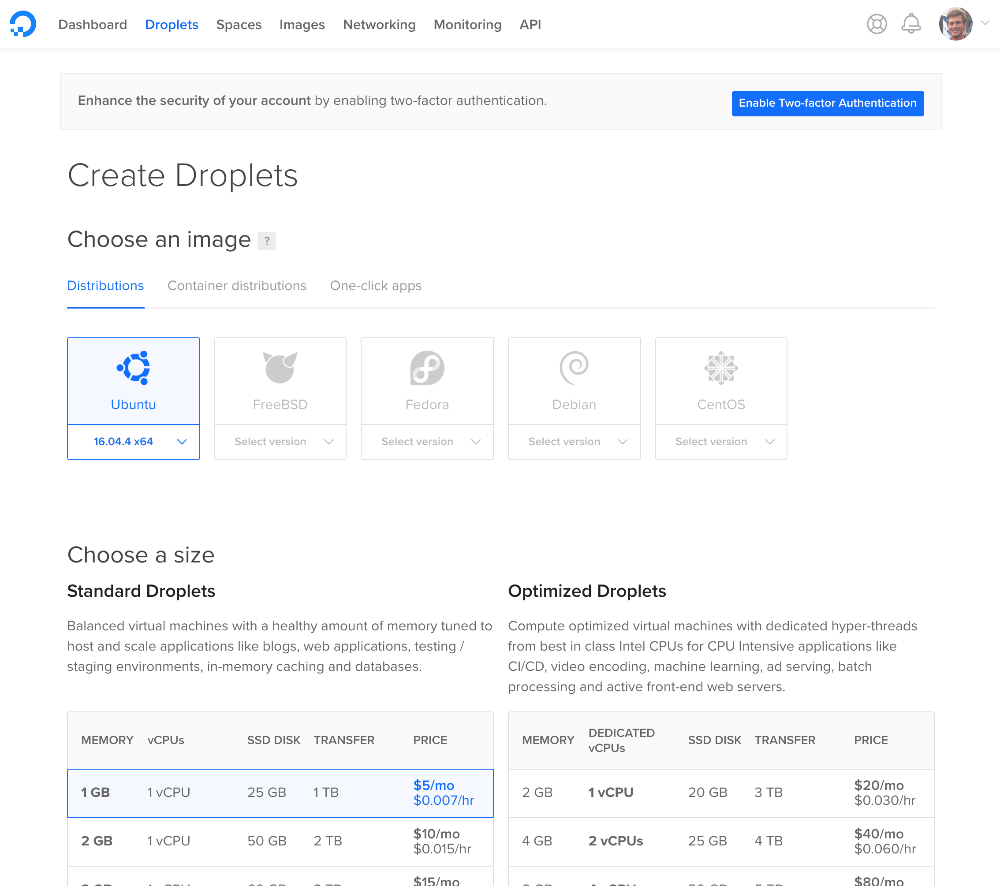
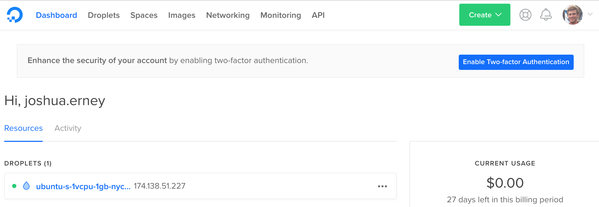
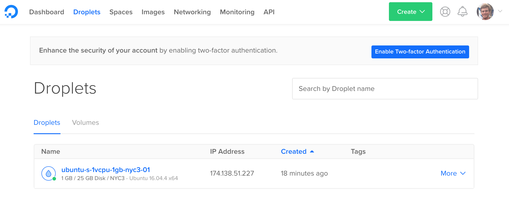

# Ghost Hosting Tutorial: Digital Ocean

## Purpose

The purpose of this document is to detail how to launch a virtual server using Digital Ocean (referred to as a droplet), and run the Ghost publishing platform on that server. We'll assume y ou already have created and set up an account of Digital Ocean.

## Configuring the Droplet

To configure the droplet, click the "Droplets" tab, and click the "Create Droplet" button.



Here, we will use the default distribution, Ubuntu 16.04, in the "Choose an image" section. Ubuntu 16.04 is the only OS officially supported by Ghost. Choose a 1 GB Standard Droplet in the "Choose a size" section.



We will use the defaults for the remainder of the configurations. Scroll to the bottom of the page and click the "Create" button.

Eventually, you should see that your droplet has been created:



If you check your email, you should see an email from Digital Ocean with the subject "Your New Droplet: <droplet-name>". This email contains the droplet name, IP address, username, and the password to access your new droplet via ssh. Go ahead and copy the IP address to your clipboard and head over to your command line. Type in the following command:

```
$ ssh root@<paste-droplet-ip-address-here>
```

Head back to the email and copy the password to your clipboard. Paste this into the command line when prompted for it. You will be asked to setup a new password for the root user. Go ahead and do that. Now you're in!

## Installing Ghost

First, we will need to establish all the prerequisites for install Ghost-CLI, Ghost's command line interface tool. Using the command line, setup a new user and log in as the created user (note: everything after `#` is a comment and should not be included in the command):

```
root:~# adduser ghost-user          # add new user
root:~# usermod -aG sudo ghost-user # give new user elevated permissions
root:~# su - ghost-user             # login as new user
ghost-user:~$
```

Next, update the package list and upgrade the install packages:

```
ghost-user:~$ sudo apt-get update && sudo apt-get upgrade
```

Install NGINX:

```
ghost-user:~$ sudo apt-get install nginx
```

Make sure the firewall allows HTTP(S) connections:

```
ghost-user:~$ sudo ufw allow 'Nginx Full'
```

Install MySQL, *making sure to set a password for the root user*:

```
ghost-user:~$ sudo apt-get install mysql-server
```

Next, we will add the NodeSource APT repository for Node 6 so that we can install Node.Js, then we will install Node.js:

```
ghost-user:~$ curl -sL https://deb.nodesource.com/setup_6.x | sudo -E bash
ghost-user:~$ sudo apt-get install -y nodejs
```

Let's install the Ghost-CLI:

```
ghost-user:~$ sudo npm i -g ghost-cli
```

And then verify it installed correctly:

```
ghost-user:~$ ghost help
```

Now create a new folder for Ghost to reside, give your ghost-user ownership of this direction, give the folder the correct permissions, and navigate to the folder:

```
ghost-user:~$ sudo mkdir -p /var/www/ghost
ghost-user:~$ sudo chown ghost-user:ghost-user /var/www/ghost
ghost-user:~$ sudo chmod 775 /var/www/ghost
ghost-user:~$ cd /var/www/ghost
```

And now, the moment you're been waiting for. Install Ghost:

```
ghost-user:/var/www/ghost$ ghost install
```

You'll be asked a few questions during the setup, the first being what you'd like your blog URL to be. Go back to your web browser and select the "Droplets" tab. In the IP Address column, hover over the IP address of the droplet you just created and click "copy".



Return to the SSH session in your command line. The entry for your prompts shoud look like this:

```
? Enter your blog URL: http://<paste-your-droplet-public-ip-here>
? Enter your MySQL hostname: localhost
? Enter your MySQL username: root
? Enter your MySQL password: [hidden]
? Enter your Ghost database name: ghost_prod
? Do you wish to set up "ghost" mysql user? Yes
? Do you wish to set up Nginx? Yes
? Do you wish to set up SSL? No
? Do you wish to set up Systemd? Yes
? Do you want to start Ghost? Yes
```

Now that Ghost is running, go ahead and paste the URL you copied earlier into your favorite web browser and admire your handy work!
